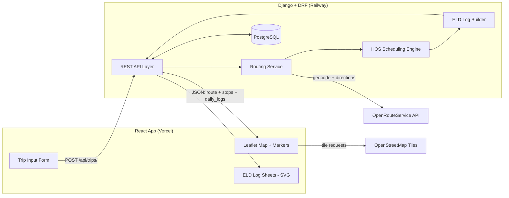

# ARCHITECTURE.md

System architecture for the **Trip Planner & ELD Log Generator** — a full-stack
app that takes trip details as input and outputs a route with required stops plus
filled-out driver daily log sheets.

---

## 1. Overview

A user enters four trip details. The app computes a legal driving plan that
respects U.S. Federal Hours-of-Service (HOS) regulations, then returns:

1. A **route** drawn on a map, annotated with rest, fuel, pickup, and drop-off stops.
2. **Daily log sheets** — one per calendar day of the trip — with the duty-status
   graph drawn and the header/remarks filled in.

**Inputs:** current location, pickup location, drop-off location, current cycle
hours used.

**Fixed assumptions** (per the assessment brief):
- Property-carrying driver, **70 hours / 8 days** cycle.
- No adverse driving conditions.
- Fueling at least once every **1,000 miles**.
- **1 hour** each for pickup and drop-off.

The hard part is not the map or the web plumbing — it is the **HOS scheduling
engine** that decides *when* the driver must stop, and the **ELD renderer** that
turns that schedule into log sheets.

---

## 2. Tech Stack

| Layer | Choice | Why |
|---|---|---|
| Frontend framework | React | Required by the brief |
| Map display | Leaflet (`react-leaflet`) + OpenStreetMap tiles | Free, no key, React-friendly |
| Backend framework | Django + Django REST Framework | Required by the brief; DRF gives clean serializers/validation |
| Routing + geocoding | OpenRouteService (ORS) | Free tier (2,000 directions/day), one key covers both, has a heavy-vehicle profile, official Python client |
| Database | PostgreSQL (prod) / SQLite (dev) | Stores saved trips for shareable result links |
| Frontend hosting | Vercel | Per the brief |
| Backend hosting | Railway | Django runs poorly on Vercel's serverless model; Railway gives a managed Postgres in the same project with one click |

**Architectural rule:** the ORS API key lives **only on the backend**. ORS keys
must never be used client-side (the browser would expose the key). React never
calls ORS directly — it calls our Django API, and Django calls ORS.

---

## 3. System Architecture



The request is computed synchronously: one POST returns the full result (route,
stops, and all log sheets). No background jobs are needed for trip sizes in scope.

---

## 4. Repository Layout

A monorepo with two top-level apps. `ARCHITECTURE.md` and `CLAUDE.md` sit at the
root.

```
trip-eld-planner/
├── ARCHITECTURE.md
├── CLAUDE.md
├── README.md
├── .gitignore
│
├── backend/
│   ├── manage.py
│   ├── requirements.txt
│   ├── .env.example
│   ├── config/                 # Django project
│   │   ├── settings/
│   │   │   ├── base.py
│   │   │   ├── dev.py
│   │   │   └── prod.py
│   │   ├── urls.py
│   │   └── wsgi.py
│   └── apps/
│       ├── trips/              # API layer: models, serializers, views, urls
│       │   ├── models.py
│       │   ├── serializers.py
│       │   ├── views.py
│       │   ├── urls.py
│       │   └── tests/
│       ├── routing/            # ORS integration (geocoding + directions)
│       │   ├── client.py       # thin ORS HTTP wrapper
│       │   ├── service.py      # geocode + multi-leg route assembly
│       │   └── tests/
│       ├── hos/                # HOS scheduling engine — PURE PYTHON, no Django
│       │   ├── constants.py    # all HOS numbers as named constants
│       │   ├── models.py       # dataclasses: DutySegment, Timeline, etc.
│       │   ├── engine.py       # the scheduling algorithm
│       │   └── tests/
│       └── eld/                # turns a Timeline into per-day log sheets
│           ├── builder.py      # split timeline by calendar day
│           ├── models.py       # dataclasses: DailyLog
│           └── tests/
│
└── frontend/
    ├── package.json
    ├── .env.example
    ├── index.html
    └── src/
        ├── main.jsx
        ├── App.jsx
        ├── api/
        │   └── tripApi.js      # single place that talks to the backend
        ├── components/
        │   ├── TripForm/
        │   ├── RouteMap/       # Leaflet map + route polyline + stop markers
        │   ├── LogSheet/       # one ELD log sheet, drawn as SVG
        │   ├── LogSheetList/   # renders one LogSheet per trip day
        │   └── common/         # buttons, spinners, error banner
        ├── hooks/
        │   └── useTripPlan.js  # request state: loading / error / data
        └── styles/
```

---

## 5. Backend Architecture

The backend is layered so the HOS logic is **fully decoupled from Django**. The
engine is plain Python that takes data in and returns data out — which makes it
trivial to unit test and reason about.

### 5.1 Layers

```
HTTP request
   │
   ▼
API layer (trips/)         ── validates input, orchestrates, serializes output
   │
   ▼
Routing service (routing/) ── geocodes locations, gets road legs from ORS
   │
   ▼
HOS engine (hos/)          ── pure domain logic: produces the duty timeline
   │
   ▼
ELD builder (eld/)         ── slices the timeline into daily log sheets
   │
   ▼
API layer                  ── returns JSON
```

### 5.2 Routing service (`apps/routing/`)

- `client.py` — a thin wrapper around the ORS HTTP API / Python client. Knows
  nothing about trips. Handles auth, retries, and timeouts.
- `service.py` — geocodes the three location strings into coordinates, then
  requests two driving legs (current → pickup, pickup → drop-off). Returns, per
  leg: encoded geometry, total distance, total duration, and cumulative
  distance markers along the path (needed to place fuel stops).
- **Caching:** geocoding results are cached (same city string → same coordinates)
  to stay well under ORS rate limits.

### 5.3 HOS scheduling engine (`apps/hos/`) — the core

This is the heart of the app. It is **pure Python with no I/O and no Django
imports** so it can be tested exhaustively.

**Input:** the route legs (distance + duration + geometry) and the driver's
current cycle hours used.

**Output:** a `Timeline` — an ordered list of `DutySegment` objects:

```
DutySegment
  status:   OFF_DUTY | SLEEPER_BERTH | DRIVING | ON_DUTY_NOT_DRIVING
  start:    timezone-aware datetime  (home-terminal time)
  end:      timezone-aware datetime
  location: human-readable place + coordinates
  note:     e.g. "Pickup", "Fuel stop", "30-min break", "10-hr reset"
```

**Algorithm (simplified):** the engine walks the trip forward in time. At each
step it computes the *next constraint* — whichever of these comes first:

- the 11-hour driving limit is reached,
- the 14-hour on-duty window is reached,
- 8 cumulative driving hours since the last break (→ insert 30-min break),
- the next 1,000-mile fuel point on the route,
- the 70-hour cycle limit is reached (→ insert a 34-hour restart),
- the next leg event (pickup, drop-off, destination).

It drives until that constraint, appends the appropriate segment(s), updates all
running clocks, and repeats until the drop-off is reached. See `CLAUDE.md` for the
exact correctness rules these clocks must obey.

### 5.4 ELD log builder (`apps/eld/`)

Takes the `Timeline` and produces one `DailyLog` per calendar day:

```
DailyLog
  date
  segments[]        # segments clipped to midnight–midnight, home-terminal time
  total_off_duty    # the four totals must sum to exactly 24:00
  total_sleeper
  total_driving
  total_on_duty
  total_miles       # miles driven that day
  remarks[]         # location of each duty-status change
```

A driving or rest period that crosses midnight is **split** across two
`DailyLog`s. This is the most common source of bugs — see `CLAUDE.md`.

### 5.5 API layer (`apps/trips/`)

- `models.py` — a `Trip` model storing the inputs and the computed result
  (route + logs as JSON). Enables `GET /api/trips/{id}/` for shareable links.
- `serializers.py` — DRF serializers; **all input validation lives here**.
- `views.py` — orchestrates routing → HOS → ELD, persists the `Trip`, returns it.

---

## 6. Frontend Architecture

React is a **thin presentation layer**. It does no HOS math — it sends inputs and
renders whatever the backend returns.

### 6.1 Component tree

```
App
├── TripForm            # 4 inputs + submit; client-side validation
├── useTripPlan (hook)  # owns loading / error / result state
├── RouteMap            # Leaflet map, route polyline, stop markers
└── LogSheetList
    └── LogSheet × N    # one SVG log sheet per trip day
```

### 6.2 Map rendering

`RouteMap` uses `react-leaflet`. It draws the route polyline from the geometry
the backend returns and places markers for pickup, drop-off, fuel stops, breaks,
and rest periods, with popups describing each stop.

### 6.3 Log sheet rendering

`LogSheet` renders the FMCSA daily log as **SVG** (chosen over a raster image
because it is crisp at any zoom, easy to style to match the design, and
straightforward to export to PNG/PDF later). It draws the 24-hour grid, the four
duty-status rows, the step line connecting the segments, the header fields, and
the remarks. The backend supplies the structured `DailyLog` data; the component
owns only the drawing.

### 6.4 API access

All backend communication goes through `src/api/tripApi.js`. Components never
call `fetch` directly — this keeps the network layer in one testable place.

---

## 7. Request Lifecycle

1. User fills `TripForm`; client-side validation passes; React `POST`s the four
   inputs to `/api/trips/`.
2. DRF serializer validates the payload.
3. Routing service geocodes the three locations via ORS.
4. Routing service requests the two driving legs from ORS (geometry, distance,
   duration, cumulative-distance markers).
5. HOS engine consumes the legs + cycle hours and produces the `Timeline`.
6. ELD builder slices the `Timeline` into a list of `DailyLog`s.
7. The `Trip` (inputs + result) is saved to the database.
8. The API responds with JSON: `route` geometry, `stops[]`, `daily_logs[]`,
   and a `summary` (total distance, total drive time, number of days).
9. React renders the route on `RouteMap` and one `LogSheet` per day.

---

## 8. API Contract

### `POST /api/trips/`
Create and compute a trip.

**Request**
```json
{
  "current_location": "Chicago, IL",
  "pickup_location": "Dallas, TX",
  "dropoff_location": "Denver, CO",
  "current_cycle_hours": 12.5
}
```

**Response (200)**
```json
{
  "id": "a1b2c3",
  "summary": { "total_miles": 1620, "total_drive_hours": 25.5, "days": 3 },
  "route": { "geometry": "<encoded polyline>", "legs": [ ... ] },
  "stops": [
    { "type": "pickup",   "location": "Dallas, TX",  "lat": 0, "lng": 0 },
    { "type": "fuel",     "location": "near mile 1000", "lat": 0, "lng": 0 },
    { "type": "rest",     "location": "...", "lat": 0, "lng": 0 }
  ],
  "daily_logs": [
    {
      "date": "2026-05-18",
      "segments": [ { "status": "driving", "start": "06:00", "end": "11:00", "location": "..." } ],
      "totals": { "off_duty": 10, "sleeper": 0, "driving": 11, "on_duty": 3 },
      "total_miles": 600,
      "remarks": [ { "time": "06:00", "location": "Chicago, IL" } ]
    }
  ]
}
```

### `GET /api/trips/{id}/`
Retrieve a previously computed trip (for shareable result URLs).

### `GET /api/health/`
Liveness probe for the hosting platform.

**Errors** use consistent JSON: `{ "error": { "code": "...", "message": "..." } }`
with appropriate HTTP status (400 invalid input, 502 ORS upstream failure, etc.).

---

## 9. Domain Logic: HOS Rules Encoded

The engine enforces these limits for a property-carrying, 70/8 driver:

| Rule | Limit | Reset condition |
|---|---|---|
| Driving limit | 11 hours of driving per shift | 10 consecutive hours off duty |
| On-duty window | 14 consecutive hours; driving not allowed past it | 10 consecutive hours off duty |
| 30-minute break | required after 8 **cumulative** driving hours | a 30-min non-driving period |
| Cycle limit | 70 on-duty hours in any rolling 8 days | a 34-hour restart |
| Pickup / drop-off | 1 hour each, logged on-duty (not driving) | n/a |
| Fueling | a stop at least every 1,000 miles, on-duty (not driving) | n/a |

These thresholds are defined once as named constants (`apps/hos/constants.py`) and
referenced everywhere — never hard-coded inline. Correctness rules and edge cases
are detailed in `CLAUDE.md`.

---

## 10. ELD Log Rendering Approach

- The **backend owns the truth**: it computes the duty-status timeline and the
  per-day totals.
- The **frontend owns the drawing**: `LogSheet` renders the grid and the step
  line as SVG from that data.
- Each log sheet represents exactly **one calendar day** (midnight to midnight,
  home-terminal time). Long trips therefore produce multiple sheets.
- The four duty-status row totals on every sheet must sum to exactly 24 hours;
  the builder asserts this before returning.

---

## 11. External Integrations

| Service | Used for | Notes |
|---|---|---|
| OpenRouteService | geocoding + driving directions | Backend only. Key in env var. Geocoding results cached. Graceful 502 on failure. |
| OpenStreetMap tiles | base map imagery | Loaded directly by Leaflet in the browser. No key. Respect the tile usage policy. |

---

## 12. Data Model

```
Trip
  id                    (short unique id, used in shareable URLs)
  current_location      string
  pickup_location       string
  dropoff_location      string
  current_cycle_hours   decimal
  result                JSON   (computed route + stops + daily_logs)
  created_at            datetime
```

Storing the computed `result` makes `GET /api/trips/{id}/` cheap and avoids
re-calling ORS for a trip that was already planned.

---

## 13. Deployment

| Component | Platform | Notes |
|---|---|---|
| Frontend | Vercel | Build the React app from the `frontend/` directory; set `VITE_API_BASE_URL` to the Railway backend URL |
| Backend | Railway | One service per repo's `backend/` directory; environment variables set in the Railway dashboard |
| Database | Railway managed PostgreSQL | Added as a separate plugin in the same Railway project; `DATABASE_URL` is auto-injected into the backend service |

### 13.1 Railway service configuration

The backend service runs from `backend/` with:

- **Build:** Railway's Nixpacks detects Django automatically (`requirements.txt`
  + `manage.py`). No build command needed unless customizing.
- **Start command:** `gunicorn config.wsgi --bind 0.0.0.0:$PORT --log-file -`.
  `$PORT` is provided by Railway — never hard-code a port.
- **Pre-deploy / release command:** `python manage.py migrate --noinput`. This
  runs against the production Postgres before the new release goes live so the
  schema is always current.
- **Static files:** served by WhiteNoise (already in `MIDDLEWARE`). Run
  `python manage.py collectstatic --noinput` as part of build, or include it in
  the release command before `migrate`.

### 13.2 Required environment variables on Railway (backend service)

| Variable | Value | Source |
|---|---|---|
| `DJANGO_SETTINGS_MODULE` | `config.settings.prod` | manual |
| `DJANGO_SECRET_KEY` | a freshly generated 50-char random string | `python -c "from django.core.management.utils import get_random_secret_key; print(get_random_secret_key())"` |
| `ALLOWED_HOSTS` | the Railway-provided backend domain (e.g. `trip-eld-api.up.railway.app`) | Railway dashboard |
| `CORS_ALLOWED_ORIGINS` | the deployed Vercel origin (e.g. `https://trip-eld.vercel.app`) | Vercel dashboard |
| `DATABASE_URL` | `${{Postgres.DATABASE_URL}}` reference | auto-injected by Railway when Postgres is linked |
| `ORS_API_KEY` | OpenRouteService API key | openrouteservice.org |
| `ORS_TIMEOUT_SECONDS` | `15` (optional override) | manual |

The Vercel frontend takes only `VITE_API_BASE_URL`, set to the Railway backend
domain over HTTPS.

CORS on the backend must explicitly allow the Vercel frontend origin. All secrets
come from environment variables — never committed.

---

## 14. Key Design Decisions

1. **HOS engine is pure Python, decoupled from Django.** The most complex and
   most-tested code has zero framework or I/O dependencies, so it can be verified
   in isolation.
2. **Backend computes, frontend renders.** No HOS math in React; the browser
   only displays backend output. One source of truth.
3. **ORS is called server-side only.** Protects the API key and keeps routing
   logic in one place.
4. **Synchronous request/response.** Trip sizes in scope compute fast enough that
   background jobs add complexity for no benefit.
5. **Log sheets as SVG.** Crisp, themeable, exportable — better than rasterizing
   the blank log image.
6. **Trips are persisted.** Enables shareable result links and avoids redundant
   ORS calls.